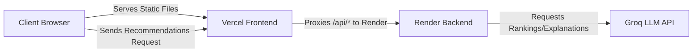

# Deployment Plan: Vercel (Frontend) & Render (Backend)

This document provides a step-by-step guide to deploying the AI-Powered Restaurant Recommendation System. 

The application is structured into two main parts:
1. **Backend**: A Python FastAPI application using a local Parquet dataset (`data/processed/restaurants.parquet`) and the Groq LLM API.
2. **Frontend**: A static HTML/CSS/JavaScript client located in `src/app/static/`.

---

## High-Level Architecture Overview



---

## 1. Backend Deployment on Render

Render is used to host the FastAPI backend application. Since the backend handles the database loading (`restaurants.parquet`) and calls the Groq API key securely, it must run as a server environment.

### Step 1: Create a Render Web Service
1. Go to the [Render Dashboard](https://dashboard.render.com/) and click **New > Web Service**.
2. Connect your GitHub repository containing the project.
3. Configure the following service settings:
   - **Name**: `zomato-recommendation-backend` (or a name of your choice)
   - **Runtime**: `Python 3`
   - **Branch**: `main` (or your active branch)
   - **Root Directory**: `.` (leave as repository root)
   - **Build Command**: 
     ```bash
     pip install -r requirements.txt
     ```
     *(Optional: If you need to re-run ingestion, append `&& python scripts/ingest.py`)*
   - **Start Command**:
     ```bash
     PYTHONPATH=src uvicorn app.api.endpoints:app --host 0.0.0.0 --port $PORT
     ```
     *(Note: Render injects the `$PORT` environment variable automatically, which uvicorn binds to)*
   - **Instance Type**: `Free` (or any tier of your choice)

### Step 2: Configure Environment Variables
In the Render dashboard under the **Environment** tab, add the following environment variables:

| Variable Name | Required | Default Value | Description |
| :--- | :--- | :--- | :--- |
| `LLM_API_KEY` | **Yes** | *[None]* | Your Groq API Key (starts with `gsk_`) |
| `LLM_PROVIDER` | No | `groq` | The LLM provider name |
| `LLM_MODEL` | No | `llama-3.1-8b-instant` | The model ID used for processing |
| `DATA_PATH` | No | `data/processed/restaurants.parquet` | Relative path to the processed Parquet dataset |

### Step 3: Deploy & Verify Backend Health
Once Render completes building and deploying your web service:
1. Copy the deployment URL (e.g., `https://zomato-recommendation-backend.onrender.com`).
2. Visit the health check endpoint in your browser or via curl:
   ```bash
   curl https://your-backend-url.onrender.com/api/v1/health
   ```
3. You should receive a response indicating a healthy status:
   ```json
   {
     "status": "healthy",
     "database_loaded": true,
     "llm_client_ready": true
   }
   ```

---

## 2. Frontend Deployment on Vercel

Vercel is used to host the static frontend files (`index.html`, `style.css`, `app.js`). To make the frontend communicate with the backend, we use Vercel's **Rewrites** feature, proxying `/api/*` requests to Render. This avoids CORS issues and hardcoded backend URLs in client-side code.

### Step 1: Update Vercel Configuration
1. Open the [vercel.json](file:///c:/Users/Urmi%20Maheshwari/Desktop/ZOMATO%20-1/src/app/static/vercel.json) file in your editor.
2. Replace `https://zomato-recommendation-backend.onrender.com` with your **actual** Render backend URL:
   ```json
   {
     "cleanUrls": true,
     "rewrites": [
       {
         "source": "/api/:path*",
         "destination": "https://<your-actual-render-backend-url>.onrender.com/api/:path*"
       }
     ]
   }
   ```
3. Commit and push this change to your repository.

### Step 2: Create a Vercel Project
1. Log in to the [Vercel Dashboard](https://vercel.com/) and click **Add New > Project**.
2. Import your GitHub repository.
3. In the project configuration screen:
   - **Project Name**: `zomato-recommendation-frontend`
   - **Framework Preset**: `Other` (Vercel automatically detects static HTML)
   - **Root Directory**: Click *Edit* and select **`src/app/static`**. This tells Vercel that the static folder is the root of the web app, deploying `index.html` as the landing page.
4. Leave **Build and Development Settings** as default (blank, since no build step is needed).
5. Click **Deploy**.

---

## 3. Post-Deployment Verification

After both deployments succeed:
1. Open the Vercel-generated URL (e.g., `https://zomato-recommendation-frontend.vercel.app`).
2. Open your browser's Developer Tools (`F12` or `Ctrl+Shift+I`) and navigate to the **Network** tab.
3. Verify that the dropdown lists for **Location** and **Cuisine** are successfully populated (this proves the `/api/v1/metadata/*` rewrite to Render is working).
4. Enter test preferences, choose a budget, and hit **Find Restaurants**.
5. Ensure the recommendation cards render correctly, demonstrating correct communication between:
   `Vercel Frontend` $\rightarrow$ `Render Backend` $\rightarrow$ `Groq LLM` $\rightarrow$ `Client Browser`.

## Troubleshooting

- **White screen or dropdowns don't load**: 
  - Open console log in browser developer tools.
  - Verify that Vercel is sending the API requests to the correct Render URL. Ensure that your [vercel.json](file:///c:/Users/Urmi%20Maheshwari/Desktop/ZOMATO%20-1/src/app/static/vercel.json) rewrite rule matches the exact domain of your backend.
- **Backend logs show `503 Service Unavailable`**:
  - Make sure the dataset file `data/processed/restaurants.parquet` was pushed to Git and is in the correct directory.
  - Double check that you configured the `LLM_API_KEY` environment variable in Render.
- **Slow cold-starts on Render**:
  - If you are on Render's free tier, the backend web service will spin down after 15 minutes of inactivity. The first request after spin-down might take 50-60 seconds to respond as the service starts back up.
